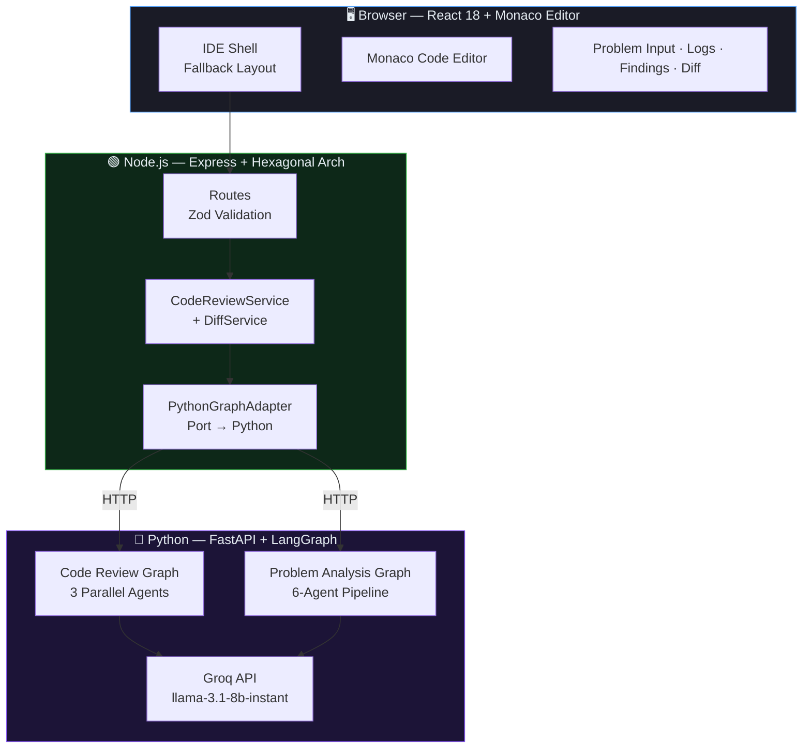
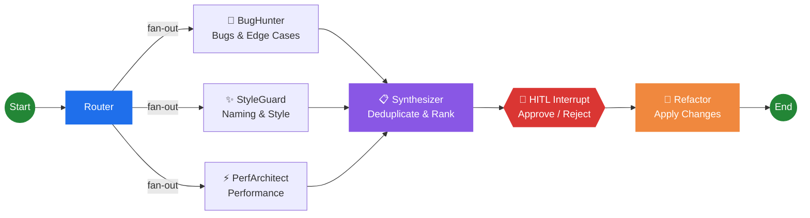
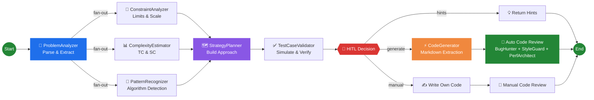
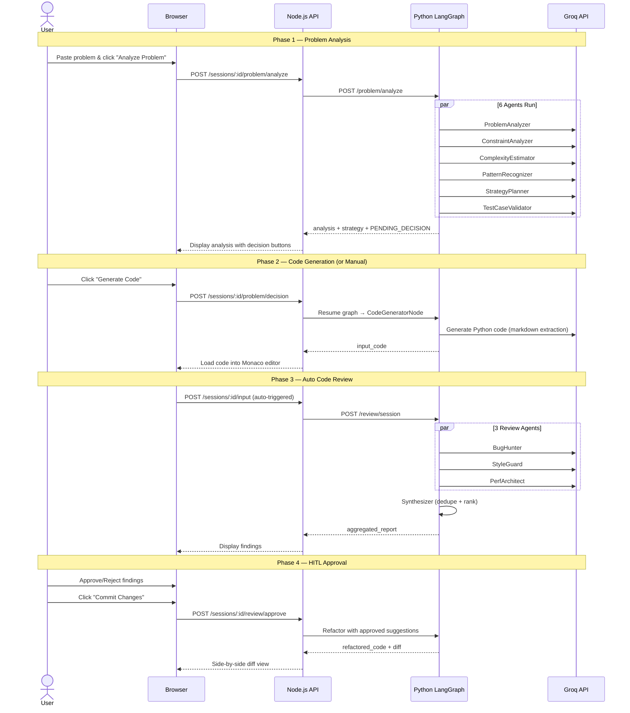

<p align="center">
  
  
  
  
  
</p>

# 🛡️ Sentinel-Graph

> **Multi-agent AI code review and problem-solving system** powered by **LangGraph** — using a low-end LLM (`llama-3.1-8b-instant`) via **Groq API** to solve complex problems through specialized agent orchestration and human-in-the-loop decision-making.

Sentinel-Graph demonstrates that small, efficient LLMs can deliver production-quality code analysis when orchestrated through a multi-agent pipeline. Three specialized review agents run in parallel to analyze code for bugs, style issues, and performance problems. A separate 6-agent problem analysis pipeline can parse competitive programming problems, detect algorithm patterns, generate solution code, and auto-review the generated output — all with a single 8B parameter model.

---

## 🎯 Core Concept

**Use a low-end LLM to solve complex problems using agents.**

Instead of relying on expensive large models, Sentinel-Graph decomposes complex tasks into focused sub-problems, assigns each to a specialized agent with a tailored prompt, and synthesizes the results. The `llama-3.1-8b-instant` model running on Groq's free tier achieves results comparable to much larger models through this agentic approach.

---

## 📸 Screenshots

<p align="center">
  
  <br />
  <em>Problem Analysis Pipeline — Parsed problem structure with constraints, complexity, and strategy</em>
</p>

<p align="center">
  
  <br />
  <em>Live Agent Pipeline Tracker — Real-time progress of all 6 analysis agents</em>
</p>

<p align="center">
  
  <br />
  <em>VS Code-style IDE — Dark mode with Monaco Editor, session sidebar, and tabbed panels</em>
</p>

<p align="center">
  
  <br />
  <em>Light Theme — Clean, modern design with seamless theme switching</em>
</p>

---

## 🏗️ Architecture

### System Overview



### Code Review Agent Graph



### Problem Analysis + Code Generation Pipeline



### Three-Tier Architecture

| Layer | Technology | Responsibility |
|-------|-----------|----------------|
| **Frontend** | React 18, Monaco Editor, Tailwind CSS | IDE-style code review UI with dark/light theme switching |
| **API Gateway** | Node.js, Express, Zod, EJS | Request validation, diff computation, session management |
| **AI Engine** | Python, FastAPI, LangGraph, Groq API | Multi-agent graph execution with HITL checkpointing |

---

## ✨ Features

### 🤖 Multi-Agent Code Review
- **BugHunter** — Finds logical bugs, runtime errors, and edge cases (with sandboxed Python execution for syntax/runtime checks)
- **StyleGuard** — Reviews naming conventions, readability, and coding best practices
- **PerfArchitect** — Identifies performance bottlenecks and algorithmic complexity issues
- **Synthesizer** — Deduplicates findings using Jaccard similarity, merges sources, ranks by severity

### 🧠 Competitive Programming Problem Analysis
- **ProblemAnalyzer** — Parses problem descriptions, extracts input/output format, constraints, and generates an AI title
- **ConstraintAnalyzer** — Analyzes constraints to determine scale, tight limits, and test case counts
- **ComplexityEstimator** — Estimates required time and space complexity with reasoning
- **PatternRecognizer** — Detects algorithm patterns (DP, two-pointer, sliding window, graph traversal, etc.)
- **StrategyPlanner** — Builds a constraints-aware solution strategy with approach steps, alternatives, and edge case plans
- **TestCaseValidator** — Simulates the strategy over sample test cases with confidence scoring

### ⚡ Autonomous Code Generation
- After problem analysis, users can choose: **Generate Code**, **Write Own**, or **Get Hints**
- Code generation uses **markdown extraction** (no fragile JSON-in-code parsing) for 100% reliable output
- Generated code is automatically loaded into the Monaco editor
- **Auto-review pipeline** — generated code is immediately run through BugHunter + StyleGuard + PerfArchitect

### 👤 Human-in-the-Loop (HITL)
- **Decision Gate** — After problem analysis, the graph pauses at an `interrupt_before` checkpoint for user decision
- Approve ✓ or reject ✕ each code review finding individually
- Bulk approve/reject actions
- Only approved changes are applied to the refactored output

### 🎨 IDE-Style UI
- **Monaco Editor** — Full VS Code experience with syntax highlighting and multi-language support
- **Light/Dark Theme** — Seamless toggle with `prefers-color-scheme` detection
- **Live Agent Pipeline** — Real-time progress tracker with elapsed timer and step-by-step visualization
- **Side-by-Side Diff** — GitHub-style diff view with line-by-line comparison
- **Session Management** — Isolated review lifecycles with AI-generated titles in the sidebar

### 🛡️ Production-Ready Resilience
- **Crash Isolation** — Agent failures return empty results without breaking the pipeline
- **Input Validation** — Zod (Node.js) + Pydantic (Python) dual validation with field validators
- **Structured Logging** — Request tracking with correlation IDs and elapsed time across both services
- **Retry Logic** — 3 automatic retries per agent with structured JSON output parsing and error recovery

---

## 🧰 Tech Stack

| Component | Technology |
|-----------|-----------|
| **AI Framework** | LangGraph (Python) with state-based checkpointing |
| **LLM** | Groq API — `llama-3.1-8b-instant` (free tier, cloud-hosted) |
| **Backend API** | Node.js + Express + TypeScript |
| **AI Engine** | Python + FastAPI + LangGraph |
| **Validation** | Zod (Node) + Pydantic v2 (Python) |
| **Architecture** | Hexagonal (Ports & Adapters) |
| **Frontend** | React 18 (CDN) + Tailwind CSS |
| **Code Editor** | Monaco Editor (VS Code engine) |
| **Diff Engine** | `diff` (Node.js library) |
| **Template** | EJS (server-rendered shell for React SPA) |

---

## 🚀 Setup

### Prerequisites

- [Node.js](https://nodejs.org/) v18+
- [Python](https://python.org/) 3.10+
- [Groq API Key](https://console.groq.com/) (free tier works)

### 1. Clone & Install

```bash
git clone https://github.com/your-username/sentinel-graph.git
cd sentinel-graph

# Node.js dependencies
npm install

# Python dependencies
cd python_service
pip install -r requirements.txt
cd ..
```

### 2. Configure Environment

```bash
cp .env.example .env
```

Create `python_service/.env` with your Groq API key:

```env
GROQ_API_KEY=your_groq_api_key_here
GROQ_MODEL=llama-3.1-8b-instant
GROQ_TEMPERATURE=0
MAX_RETRIES=3
```

**Environment variables:**

| Variable | Default | Description |
|----------|---------|-------------|
| `PORT` | `3000` | Node.js server port |
| `PYTHON_SERVICE_URL` | `http://localhost:8000` | Python AI engine URL |
| `GROQ_API_KEY` | — | Your Groq API key ([get one free](https://console.groq.com/)) |
| `GROQ_MODEL` | `llama-3.1-8b-instant` | LLM model ID on Groq |
| `GROQ_TEMPERATURE` | `0` | LLM temperature (0 = deterministic) |
| `MAX_RETRIES` | `3` | Retries per agent on JSON parse errors |

> **Available Groq models:** `llama-3.1-8b-instant`, `llama-3.3-70b-versatile`, `meta-llama/llama-4-scout-17b-16e-instruct`, `qwen/qwen3-32b`

### 3. Start Both Services

**Terminal 1 — Python AI Engine:**
```bash
cd python_service
uvicorn main:app --reload --port 8000
```

**Terminal 2 — Node.js Server:**
```bash
npm run dev
```

### 4. Open the UI

Navigate to [http://localhost:3000](http://localhost:3000)

---

## 🔄 How It Works

### End-to-End Flow



### API Endpoints

| Method | Endpoint | Description |
|--------|----------|-------------|
| `GET` | `/health` | Health check |
| `GET` | `/` | Serve the React SPA |
| `POST` | `/sessions` | Create a new session |
| `GET` | `/sessions` | List all sessions |
| `GET` | `/sessions/:id` | Get session details + analysis data |
| `POST` | `/sessions/:id/input` | Submit code for multi-agent review |
| `POST` | `/sessions/:id/problem/analyze` | Analyze a competitive programming problem |
| `POST` | `/sessions/:id/problem/decision` | Submit HITL decision (generate/manual/hints) |
| `POST` | `/sessions/:id/review/approve` | Approve findings & trigger refactoring |

---

## 📁 Project Structure

```
sentinel-graph/
├── src/
│   ├── app.ts                          # Express app entry point
│   ├── core/
│   │   ├── interfaces/                 # Port interfaces (hexagonal)
│   │   ├── services/                   # CodeReviewService, DiffService
│   │   └── schemas/                    # FindingSchema
│   ├── infrastructure/
│   │   ├── adapters/                   # PythonGraphAdapter
│   │   └── server/
│   │       ├── expressApp.ts           # Express configuration
│   │       └── routes.ts              # All API routes + session management
│   └── web/
│       └── views/
│           └── index.ejs              # Full React 18 SPA (CDN-loaded)
├── python_service/
│   ├── main.py                        # FastAPI + LangGraph (all 9 agents)
│   ├── requirements.txt               # Python dependencies
│   └── .env                           # Groq API key + model config
├── assets/
│   └── screenshots/                   # Application screenshots
├── .env.example                       # Environment template
├── package.json
├── tsconfig.json
└── README.md
```

---

## 🧪 Demo Script

A quick walkthrough to showcase the full pipeline:

1. **Open** → `http://localhost:3000` — VS Code-style dark UI loads
2. **Input a problem** → Paste: *"Given an array of integers, find two numbers that add up to a target. Return their indices."*
3. **Click Analyze Problem** → Watch 6 agents run: ProblemAnalyzer → ConstraintAnalyzer/ComplexityEstimator/PatternRecognizer → StrategyPlanner → TestCaseValidator
4. **Observe the results** → AI-generated title ("Two-pointer Array Sum"), complexity estimate (O(N)), detected pattern (hash map/two-pointer), strategy plan with approach steps, edge case analysis
5. **Click Generate Code** → AI generates a clean Python solution with proper I/O handling
6. **Auto Code Review runs** → BugHunter, StyleGuard, PerfArchitect analyze the generated code
7. **Review findings** → Approve/reject individual suggestions
8. **Commit changes** → See the side-by-side diff of original vs refactored code

**Alternative flow:** Click "Write My Own" → write code in the Monaco editor → click "Analyze Code" → same review pipeline runs on your code.

---

## 🔮 Future Improvements

- [ ] WebSocket / SSE for true real-time agent log streaming
- [ ] Persistent database (PostgreSQL / SQLite) for sessions
- [ ] Support for multiple files / project-level analysis
- [ ] Custom agent configuration per session
- [ ] Export reports (PDF / Markdown)
- [ ] CI/CD integration (GitHub Actions, GitLab CI)
- [ ] Authentication and team collaboration
- [ ] Migrate CDN dependencies to Vite build system

---

## 📌 Resume Highlights

- Designed and built a **multi-agent AI code review system** using **LangGraph** with three specialized agents (BugHunter, StyleGuard, PerfArchitect) executing in parallel via fan-out graph edges
- Implemented **human-in-the-loop (HITL)** workflow using LangGraph's `interrupt_before` checkpoint mechanism, enabling a decision gate where users choose between code generation, manual coding, or hint-only modes
- Built a **6-agent competitive programming analysis pipeline** (ProblemAnalyzer → ConstraintAnalyzer/ComplexityEstimator/PatternRecognizer → StrategyPlanner → TestCaseValidator) with parallel sub-graphs and a 3-agent code review auto-triggered on generated output
- Engineered a **markdown-extraction code generation** approach that eliminates JSON parsing failures — the LLM returns code in fenced blocks which are extracted via regex, achieving 100% reliability vs 0% with structured JSON output
- Proved that a **small 8B parameter model** (`llama-3.1-8b-instant` on Groq free tier) can deliver production-quality code analysis when orchestrated through specialized agent decomposition
- Implemented a **hexagonal architecture** Node.js API with clean port/adapter separation between the Express layer and Python LangGraph service
- Built **crash isolation** per agent — individual agent failures return empty results without breaking the pipeline, with structured retry logic and JSON output parsing across 3 attempts

---

## 📄 License

MIT
