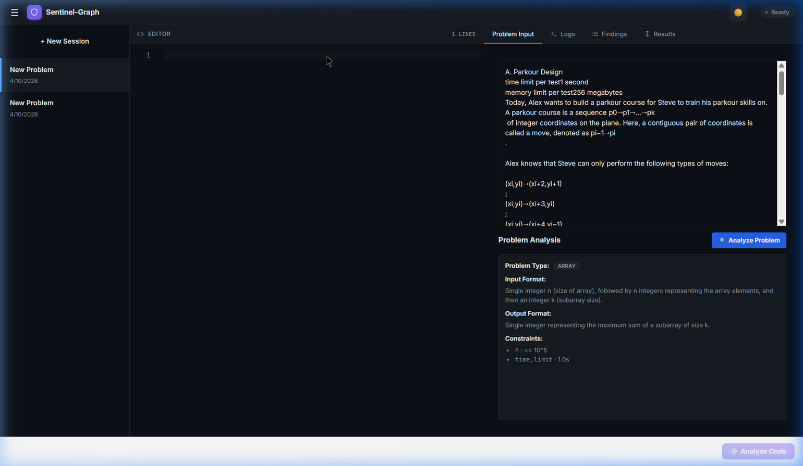
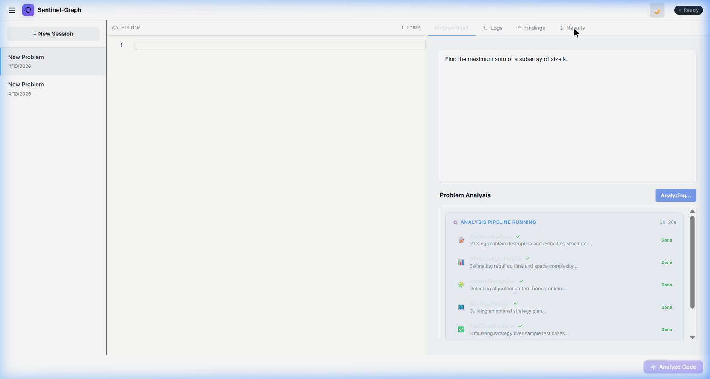
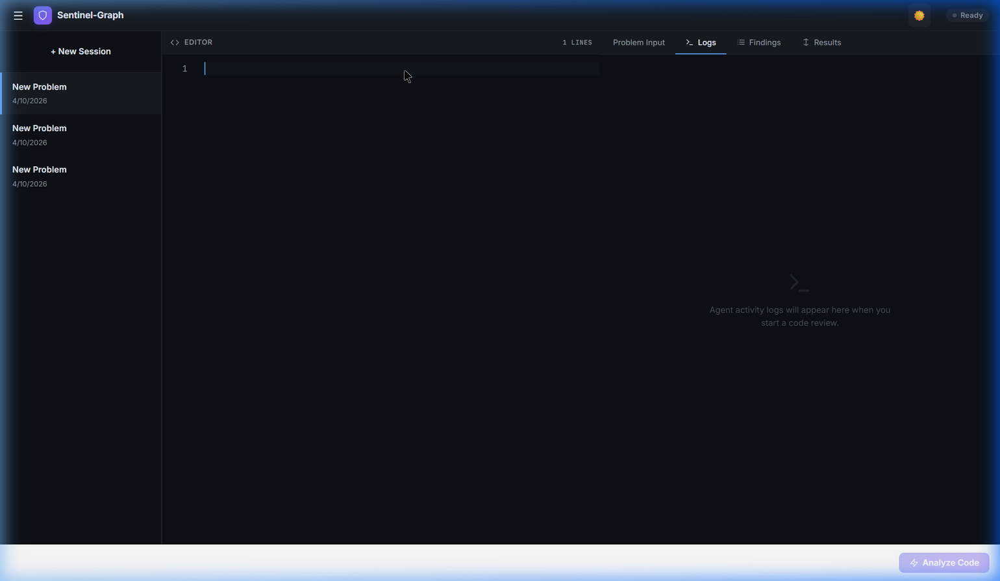
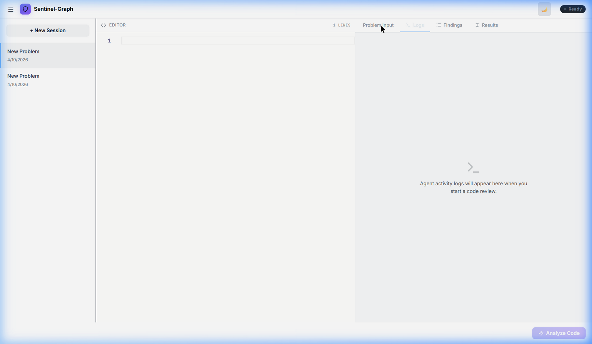
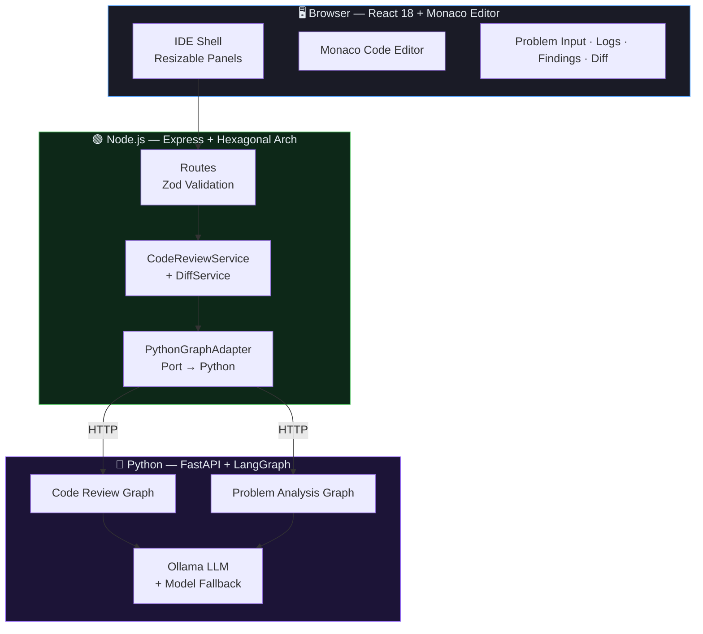
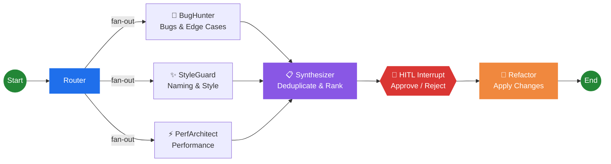
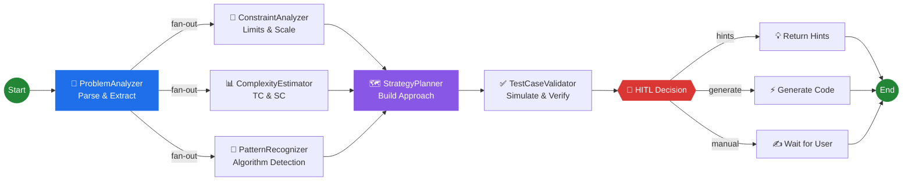
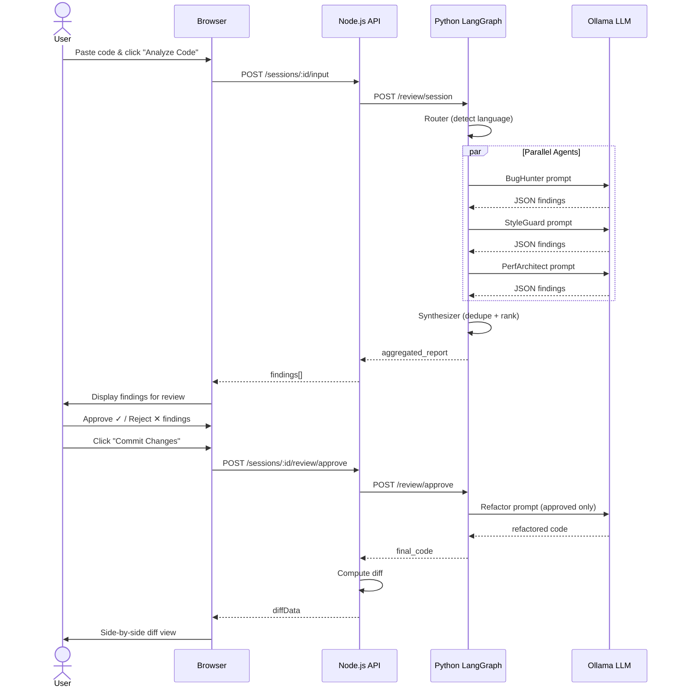

<p align="center">
  
  
  
  
  
</p>

# 🛡️ Sentinel-Graph

> **Multi-agent AI code review system** powered by **LangGraph** with human-in-the-loop approval, automatic model fallback, and a competitive programming problem analysis pipeline.

Sentinel-Graph uses **three specialized AI agents** running in parallel to analyze your code for bugs, style issues, and performance problems — then lets you selectively approve findings before generating the refactored code. It also features a **6-agent problem analysis pipeline** that can parse competitive programming problems, detect patterns, estimate complexity, and build strategy plans.

---

## 📸 Screenshots

<p align="center">
  
  <br />
  <em>Problem Analysis Pipeline — Parsed problem structure with constraints, complexity, and strategy</em>
</p>

<p align="center">
  
  <br />
  <em>Live Agent Pipeline Tracker — Real-time progress of all 6 analysis agents</em>
</p>

<p align="center">
  
  <br />
  <em>VS Code-style IDE — Dark mode with Monaco Editor, session sidebar, and tabbed panels</em>
</p>

<p align="center">
  
  <br />
  <em>Light Theme — Clean, modern design with seamless theme switching</em>
</p>

---

## 🏗️ Architecture

### System Overview



### Code Review Agent Graph



### Problem Analysis Agent Graph



### Three-Tier Architecture

| Layer | Technology | Responsibility |
|-------|-----------|----------------|
| **Frontend** | React 18, Monaco Editor, `react-resizable-panels` | IDE-style code review UI with theme switching |
| **API** | Node.js, Express, Zod, EJS | Request validation, diff computation, session management |
| **AI Engine** | Python, FastAPI, LangGraph, Ollama | Multi-agent graph execution with HITL checkpointing |

---

## ✨ Features

### 🤖 Multi-Agent Code Review
- **BugHunter** — Finds logical bugs, runtime errors, and edge cases (with sandboxed Python execution)
- **StyleGuard** — Reviews naming, readability, and coding conventions
- **PerfArchitect** — Identifies performance bottlenecks and complexity issues
- **Synthesizer** — Deduplicates findings using Jaccard similarity, merges sources, ranks by severity

### 🧠 Competitive Programming Analysis
- **ProblemAnalyzer** — Parses problem descriptions, extracts structure
- **ConstraintAnalyzer** — Analyzes constraints, infers limits
- **ComplexityEstimator** — Estimates required time/space complexity
- **PatternRecognizer** — Detects algorithm patterns (DP, sliding window, etc.)
- **StrategyPlanner** — Builds a constraints-aware solution strategy
- **TestCaseValidator** — Simulates the strategy over sample test cases

### 🔄 Intelligent Model Fallback
- **Primary model** → **Fallback chain**: Automatically switches to smaller models on connection failures
- Configurable via `OLLAMA_MODEL` and `FALLBACK_MODELS` environment variables
- Smart detection distinguishes connection crashes from parse errors

### 👤 Human-in-the-Loop (HITL)
- Approve ✓ or reject ✕ each finding individually
- Bulk approve/reject actions
- Only approved changes are applied to the refactored code

### 🎨 Premium UI
- **Monaco Editor** — Full IDE experience with syntax highlighting
- **Resizable Panels** — VS Code-style draggable panel layout
- **Light/Dark Theme** — Seamless toggle with `prefers-color-scheme` detection
- **Live Agent Pipeline** — Real-time progress tracker with elapsed timer
- **Side-by-Side Diff** — GitHub-style diff view with line-by-line comparison
- **Session Management** — Isolated review lifecycles with sidebar navigation

### 🛡️ Production-Ready
- **Crash Isolation** — Agent failures return empty results without breaking the pipeline
- **Input Validation** — Zod (Node.js) + Pydantic (Python) dual validation
- **Structured Logging** — Request tracking with correlation IDs across both services
- **Retry Logic** — Automatic retries with structured output parsing

---

## 🧰 Tech Stack

| Component | Technology |
|-----------|-----------|
| **AI Framework** | LangGraph (Python) |
| **LLM** | Ollama (local, any model — qwen2.5-coder, gemma, etc.) |
| **Backend API** | Node.js + Express |
| **AI Engine** | Python + FastAPI |
| **Validation** | Zod (Node) + Pydantic (Python) |
| **Architecture** | Hexagonal (Ports & Adapters) |
| **Frontend** | React 18 + `react-resizable-panels` |
| **Code Editor** | Monaco Editor |
| **Diff Engine** | `diff` (Node.js) |
| **Template** | EJS (server-rendered shell) |

---

## 🚀 Setup

### Prerequisites

- [Node.js](https://nodejs.org/) v18+
- [Python](https://python.org/) 3.10+
- [Ollama](https://ollama.ai/) running locally

### 1. Clone & Install

```bash
git clone https://github.com/your-username/sentinel-graph.git
cd sentinel-graph

# Node.js dependencies
npm install

# Python dependencies
cd python_service
pip install -r requirements.txt
cd ..
```

### 2. Configure Environment

```bash
cp .env.example .env
# Edit .env to customize PORT, model, etc.
```

**Key environment variables:**

| Variable | Default | Description |
|----------|---------|-------------|
| `PORT` | `3000` | Node.js server port |
| `PYTHON_SERVICE_URL` | `http://localhost:8000` | Python AI engine URL |
| `OLLAMA_MODEL` | `qwen2.5-coder:3b` | Primary LLM model |
| `FALLBACK_MODELS` | `qwen2.5-coder:1.5b,gemma4:e2b` | Comma-separated fallback chain |
| `OLLAMA_TEMPERATURE` | `0` | LLM temperature |
| `MAX_RETRIES` | `3` | Retries per model on parse errors |

### 3. Pull an Ollama Model

```bash
ollama pull qwen2.5-coder:3b

# Optional: pull fallback model
ollama pull qwen2.5-coder:1.5b
```

> **Tip:** Set `OLLAMA_NUM_PARALLEL=1` to prevent Ollama from crashing under concurrent agent requests:
> ```bash
> # Windows
> setx OLLAMA_NUM_PARALLEL 1
> # Linux/Mac
> export OLLAMA_NUM_PARALLEL=1
> ```

### 4. Start Both Services

**Terminal 1 — Python AI Engine:**
```bash
cd python_service
uvicorn main:app --reload --port 8000
```

**Terminal 2 — Node.js API:**
```bash
npm run dev
```

### 5. Open the UI

Navigate to [http://localhost:3000](http://localhost:3000)

---

## 🔄 How It Works

### Code Review Flow



### Problem Analysis Flow

```
1. Paste competitive programming problem → Click "Analyze Problem"
2. 📝 ProblemAnalyzer → Extracts structure, constraints, I/O format
3. 📐📊🧩 Three parallel agents → Constraints, Complexity, Pattern
4. 🗺️ StrategyPlanner → Merges insights into approach plan  
5. ✅ TestCaseValidator → Simulates strategy on sample cases
6. 👤 HITL Decision → Get Hints / Generate Code / Write Own
```

### API Endpoints

| Method | Endpoint | Description |
|--------|----------|-------------|
| `GET` | `/health` | Health check |
| `POST` | `/sessions` | Create new session |
| `GET` | `/sessions` | List all sessions |
| `POST` | `/sessions/:id/input` | Submit code for review |
| `POST` | `/sessions/:id/problem/analyze` | Analyze a CP problem |
| `POST` | `/sessions/:id/problem/decision` | Submit HITL decision |
| `POST` | `/sessions/:id/review/approve` | Approve findings & refactor |

---

## 📁 Project Structure

```
sentinel-graph/
├── src/
│   ├── app.ts                          # Express app entry point
│   ├── core/
│   │   ├── interfaces/                 # Port interfaces (hexagonal)
│   │   ├── services/                   # CodeReviewService, DiffService
│   │   └── schemas/                    # FindingSchema
│   ├── infrastructure/
│   │   ├── adapters/                   # PythonGraphAdapter
│   │   └── server/
│   │       ├── expressApp.ts           # Express configuration
│   │       └── routes.ts              # All API routes + sessions
│   └── web/
│       └── views/
│           └── index.ejs              # Full React 18 SPA (SSR shell)
├── python_service/
│   ├── main.py                        # FastAPI + LangGraph (all agents)
│   └── requirements.txt               # Python dependencies
├── assets/
│   └── screenshots/                   # Application screenshots
├── package.json
├── tsconfig.json
├── .env.example
└── README.md
```

---

## 🔮 Future Improvements

- [ ] WebSocket / SSE for true real-time agent streaming
- [ ] Persistent database (PostgreSQL / SQLite) for sessions
- [ ] Support for multiple files / project-level analysis
- [ ] Custom agent configuration per session
- [ ] Export reports (PDF / Markdown)
- [ ] CI/CD integration (GitHub Actions, GitLab CI)
- [ ] Authentication and team collaboration
- [ ] Migrate CDN dependencies to Vite build system

---

## 📌 Resume Highlights

- Designed and built a **multi-agent AI code review system** using **LangGraph** with three specialized agents (BugHunter, StyleGuard, PerfArchitect) executing in parallel via fan-out graph edges
- Implemented **human-in-the-loop (HITL)** workflow using LangGraph's `interrupt_before` checkpoint mechanism for selective suggestion approval before code refactoring
- Built a **6-agent competitive programming pipeline** (ProblemAnalyzer → ConstraintAnalyzer/ComplexityEstimator/PatternRecognizer → StrategyPlanner → TestCaseValidator) with parallel sub-graphs
- Engineered **automatic model fallback** with smart connection-error detection — primary model failures cascade to smaller models without user intervention
- Implemented a **hexagonal architecture** Node.js API with clean port/adapter separation between the Express layer and Python LangGraph service
- Built **crash isolation** per agent — individual agent failures return empty results without breaking the pipeline, with structured retry logic and JSON output parsing

---

## 📄 License

MIT
